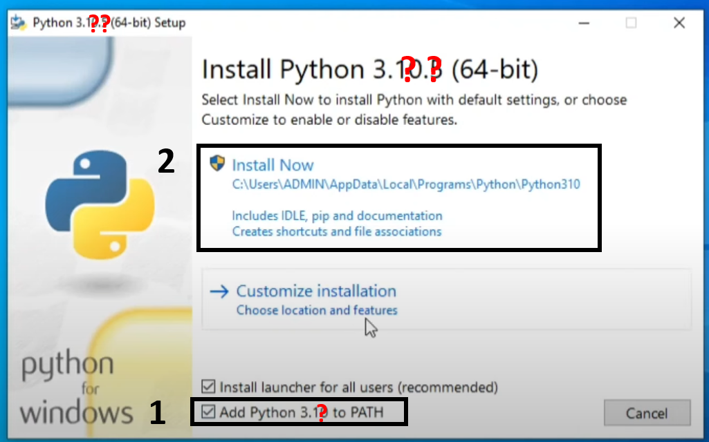
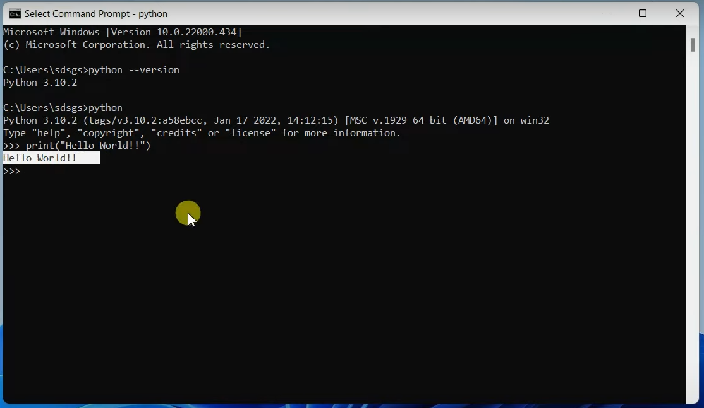
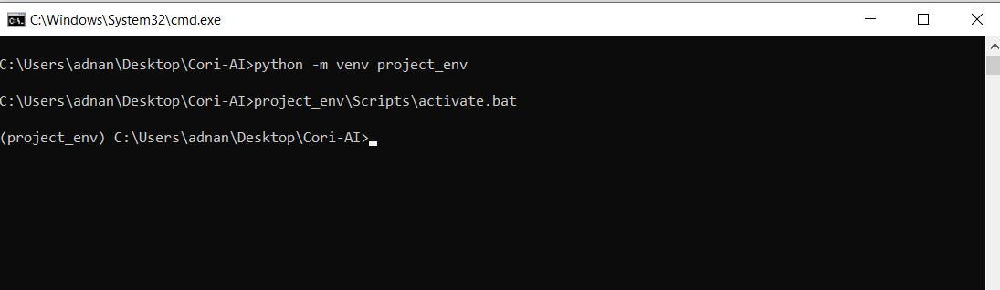
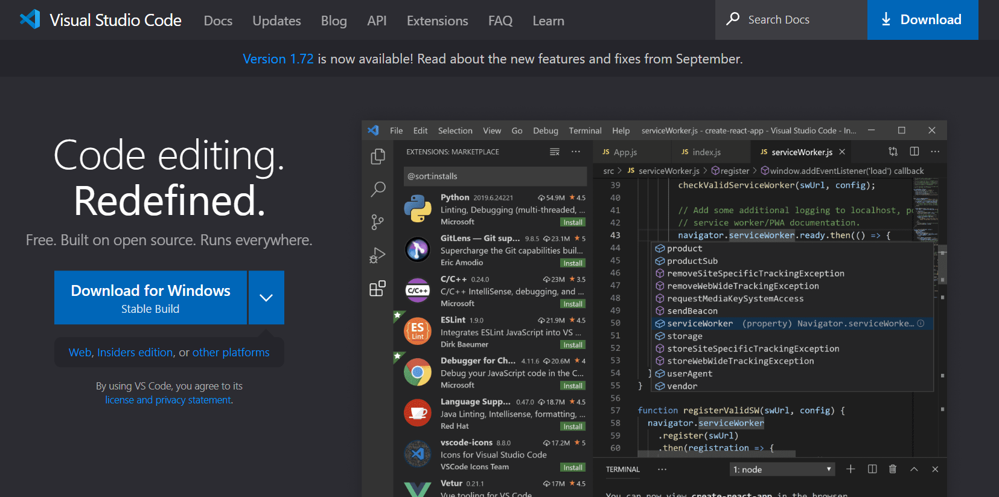
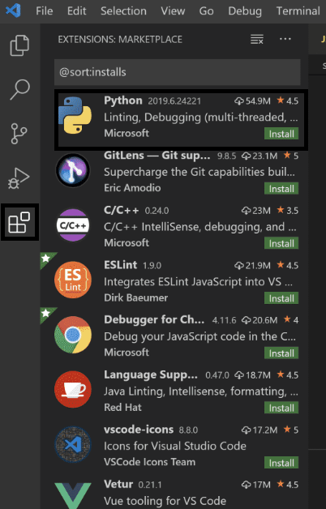
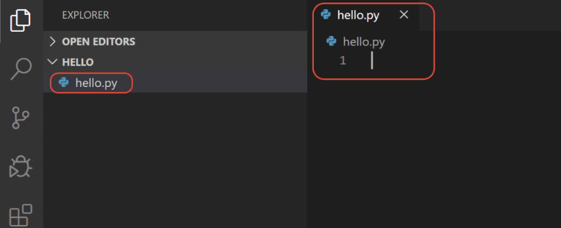
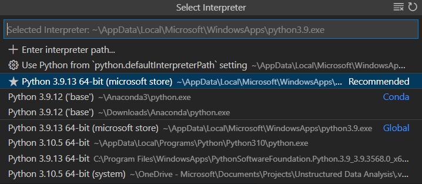
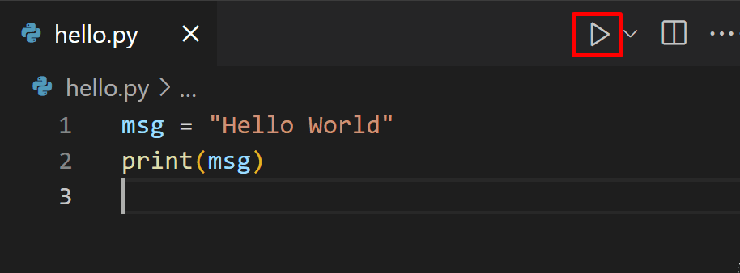

 
- [Install Python interpreter](#install-python-interpreter)
- [Create a virtual environment](#create-a-virtual-environment)
- [Install python packages](#install-python-packages)
- [Install VSCode](#install-vscode)
 
## Install Python interpreter

Python interpreter is the program that will run our actual Python code. The default downloaded interpreter is also called “base interpreter”, and for each project it’s recommended to open a new virtual environment (“venv”) with its own “project interpreter”.

1. Download Python.
   - As of the end of 2022 I recommend **Python 3.10.8 64bit** installer .exe from: https://www.python.org/downloads/release/python-3108/ ("Files" at the bottom of page).
    
2. Open installer -> **check the “add Python 3.X to Path”** -> click “Install Now” -> press “next” as needed until finish.

   
    
3. Test your installation:
   open CMD -> type `python` -> enter `print("Hello World")`

   

## Create a virtual environment
A virtual environment (venv for short) is a way to have multiple instances of the Python interpreter, each with different package sets and different configurations. This is a standart procedure when working on several different projects and every python developer should use it.

Building a venv is easy:
1. Create a new venv folder: `python -m venv <venv_name>`.
   - I recommend you build the venv dir inside the project dir.
2. Activate the venv: 
   -  Windows:  `<path_to_venv>\Scripts\activate.bat`
   -  Unix/ MacOS: `source <path_to_venv>/bin/activate`
3. Note that the venv name is now appearing in the start of the cmd lines: `(<venv_name>)`.



## Install python packages
Packages are the main way to get nontrivial functions that we are going to use, like:

- `numpy`: for matrix and vector operations.
- `matplotlib`: for graph visualization.
- `cv2`: for image processing tasks.
- `pytorch`: for neural networks.

Installation:
1. Make sure we are in our **activated** venv.
2. Install packages with `pip install <package_name>`:
   - `pip install matplotlib` (will also install numpy…)
   - `pip install torch` (a GPU enabled package also exists, but it's hard so we will skip it for now)
   - `pip install opencv-python` (this is `cv2`)

Test the installation inside python:

```python
import torch
import numpy as np
import matplotlib.pyplot as plt
import cv2

print("hello world")
```

If all installation went well, you should see  “hello world" in the cmd.

## Install VSCode
Working only on the CMD is hard... We will use VSCode which is our Integrated development environment (IDE) of choice. This will give us syntax highlighting, debugging and much more.

1. Install VSCode https://code.visualstudio.com/
   
2. Install the python extansion inside VSCode:
   
3. Open our project directory in VSCode and create a new `hello.py` file:

4. Select our Python interpreter by opening the Command Palette (Ctrl+Shift+P) and type `Python: Select Interpreter`, and select our venv.

5. Test: 

6. You can run the code in debug mode using `F5`. More about it here (https://code.visualstudio.com/docs/python/python-tutorial#_configure-and-run-the-debugger)